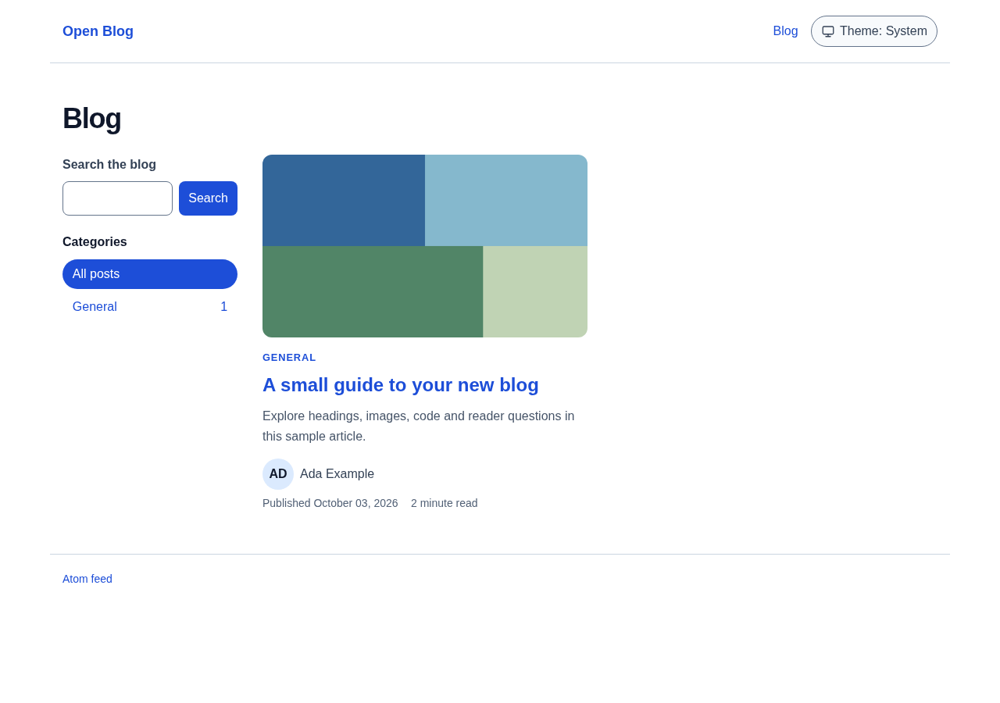
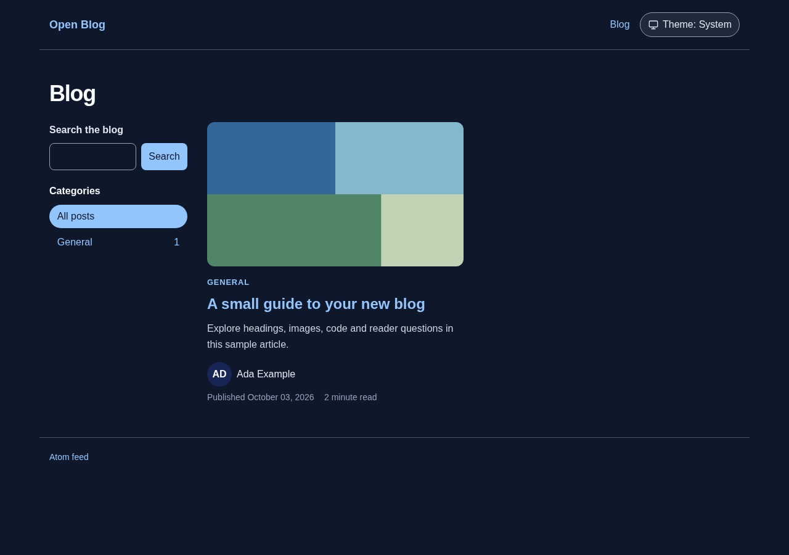

# Open Blog

A Rails blog engine with Markdown and rich-text articles, responsive reader pages, revision history, and publishing through Ruby, a JSON API, or MCP tools. Every publish, edit, approval, and removal leaves an immutable record, so a reader can trust the dates and notices on the page and an agent can publish without inventing a review.

[Documentation](https://techwright-lab.github.io/open-blog/) · [API reference](https://techwright-lab.github.io/open-blog/api/) · [Changelog](CHANGELOG.md)

## What you get

- **Reader pages** with light and dark themes, categories, tags, authors, series, search, Atom and JSON feeds, a sitemap, and structured data. The templates are copied into your app so you can change them.
- **Publishing operations** in Ruby that compute a revision identifier from the content, record each release, and refuse a public edit that does not say whether it is substantive, a correction, or maintenance.
- **A JSON API and an MCP endpoint** with scoped tokens, so editorial tools and AI agents publish through the same guarded path. Six agent workflows ship in the gem.
- **Approvals, provenance, and labels.** A post carries who wrote it, who reviewed which revision, and whether facts were checked. The AI notice on the page follows those records.
- **Adoption** of an existing blog with its known history, dates, and redirects, without claiming a new first publication.
- **Policy pages, page views, diagnostics, and surface reports** that check what readers actually see against the stored records.
- **Optional AdminSuite resources** for a browser-based editor.

## Requirements

| Requirement | Supported |
| --- | --- |
| Ruby | 3.2, 3.3, 3.4, or 4.0 |
| Rails | 8.0 or 8.1 |
| Database | PostgreSQL or SQLite |
| Images | Active Storage with libvips or ImageMagick |

Every combination of Ruby, Rails, and database above runs in CI.

## Install

Install from GitHub until a version is published on RubyGems:

```sh
bundle add open_blog --github techwright-lab/open-blog
bin/rails generate open_blog:install
```

Start `bin/dev` (or `bin/rails server`) and open `/blog`. The generator installs tables, mounts the engine at `/blog`, copies the reader views and browser controllers, writes `config/initializers/open_blog.rb`, and publishes a sample article. If it prints an API token, save it: the secret is shown once.

Set your site name, publisher, and public origin in the initializer, then run `bin/rails open_blog:doctor` to check the setup. The [installation guide](https://techwright-lab.github.io/open-blog/installation/) lists every generator option, and the [configuration reference](https://techwright-lab.github.io/open-blog/configuration/) lists every setting with its default.





## Publish a post

From Ruby:

```ruby
result = OpenBlog::Publish.call(
  { title: "Garden notes", body: "Today in the garden.", provenance: "human_written" },
  actor: "Editor"
)
result.success?   # => true
result.post.path  # => "/blog/garden-notes"
result.records    # => { revision: "new", publication: "first", approval: nil }
```

From the JSON API, with a token from `bin/rails open_blog:token`:

```sh
curl -s -X POST https://example.com/blog/api/v1/posts \
  -H "Authorization: Bearer $TOKEN" -H "Content-Type: application/json" \
  -d '{"title":"Garden notes","body":"Today in the garden.","publish":true}'
```

From an agent, point an MCP client at `https://example.com/blog/mcp` with the same token. The `blog_save_draft` tool returns a preview link, and `blog_publish_post` records the release. Agents must show the exact text to a person and record only the approval they actually give; the [publishing instructions](https://techwright-lab.github.io/open-blog/mcp/#publishing-instructions) spell this out.

A later edit of a public post must carry `change: "substantive"`, `"correction"`, or `"maintenance"`. Without it the write is refused and nothing changes. Normal model saves and the operations keep this history; bulk SQL writes bypass it.

## Guides

- [Configuration](https://techwright-lab.github.io/open-blog/configuration/): identity, routes, content gates, images, limits, and page views.
- [Publishing](https://techwright-lab.github.io/open-blog/publishing/): operations, previews, scheduling, approvals, and findings.
- [JSON API](https://techwright-lab.github.io/open-blog/api/) and [MCP](https://techwright-lab.github.io/open-blog/mcp/): endpoints, tools, examples, and error codes.
- [Reader pages and feeds](https://techwright-lab.github.io/open-blog/reader/): routes, search, feeds, dates, images, and policy pages.
- [Adoption](https://techwright-lab.github.io/open-blog/adoption/): import existing articles and preserve their known history.
- [Customization](https://techwright-lab.github.io/open-blog/customization/): copied templates, themes, and browser controllers.
- [AdminSuite](https://techwright-lab.github.io/open-blog/admin-suite/), [Diagnostics](https://techwright-lab.github.io/open-blog/diagnostics/), and [Page views](https://techwright-lab.github.io/open-blog/analytics/).

## Development

The gem tests run through a dummy host application. Set `DB` to `sqlite` or `postgres`:

```sh
bundle install
DB=sqlite RAILS_ENV=test bundle exec ruby bin/test
bundle exec rubocop
```

CI runs the matrix of Ruby 3.2 to 4.0, Rails 8.0 and 8.1, and both databases, plus browser tests and a fresh-application installer check with the built gem.

The documentation is Markdown in `docs/`, built with Jekyll and Just the Docs from a separate bundle. See [working on the documentation](https://techwright-lab.github.io/open-blog/contributing/) for local preview and validation commands.

## Releases

The **Prepare Release** workflow updates the version and changelog in a pull request. After review, merge, and successful checks, **Publish** publishes the verified package to RubyGems and creates or updates the GitHub Release. Merging ordinary changes does not publish a gem. See the [release guide](https://techwright-lab.github.io/open-blog/releases/) for the first-time Trusted Publishing setup.

## License

Licensed under the [MIT License](LICENSE.txt).
